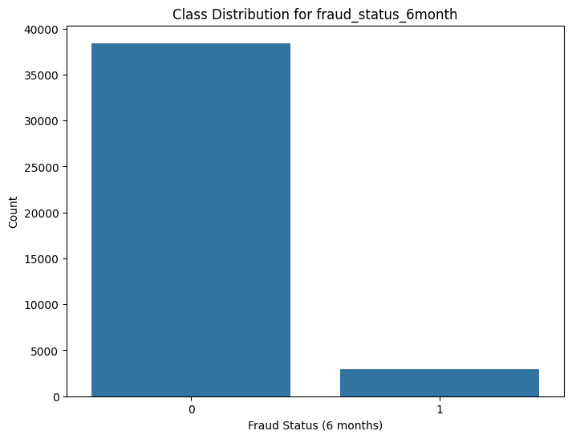
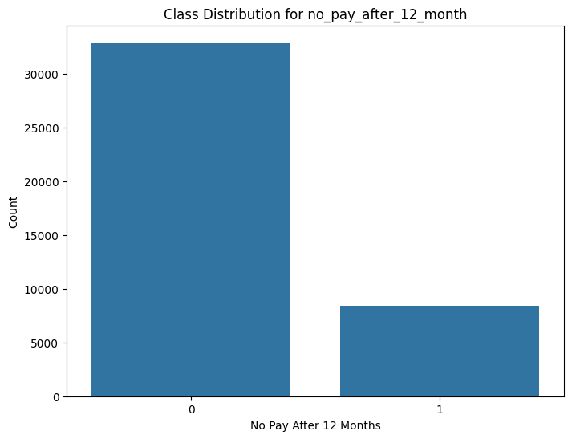

# AWS Event-Driven Fraud Detection Project

This project implements an event-driven architecture for preprocessing CSV files uploaded to an S3 bucket using AWS Lambda, with a focus on preparing data for a fraud detection model. The architecture includes S3 buckets for data storage, a Lambda function for initial data processing, and a Jupyter notebook for detailed preprocessing, model training, and evaluation.

## Architecture Overview

- **S3 Buckets**:
  - **Landing Zone**: The initial bucket where raw CSV files (e.g., transaction data) are uploaded.
  - **Curated Zone**: The bucket where data, having undergone initial cleaning and preprocessing by Lambda, is stored.

- **AWS Lambda Function**:
  - Triggered by S3 PUT events in the landing zone bucket.
  - Reads CSV files, performs initial preprocessing (e.g., basic data type validation, removing clearly irrelevant attributes or rows with excessive missing values), and saves the processed data to the curated zone.

- **Jupyter Notebook (`fraud-detection.ipynb`)**:
  - Loads preprocessed data from the curated S3 bucket.
  - Performs in-depth data cleaning, feature engineering, and preprocessing for fraud detection dataset.
  - Trains various machine learning models using the scikit-learn library and XGBoost to optimize the fraud classification.
  - Evaluates model performance using F1 score.

## Fraud Detection Notebook Rationale

The Jupyter notebook can be found in `src/notebooks/fraud_detection/fraud-detection.ipynb`

### Data Preprocessing Techniques

Effective preprocessing is critical for building a robust fraud detection model. The techniques used include:

- **Handling Missing Values**: Missing data will give the modell hard time for recognizing patterns. In the project imputation were use to handle this case.
- **Feature Scaling and Transformation**:
  - For **Logistic Regression** model **Log Transformation** was applied to skewed numerical features, followed by **Standard Scaling** (Z-score normalization). This helps the model converge faster and perform better.
  - For other models evaluated in this project only the **Log Transformation** was applied to skewed numerical features. So they can capture non-linear relationships better.
- **Encoding Categorical Features**:
  - For **ordinal categorical features** (where categories have a natural order), **LabelEncoder** was used to convert them into numerical representations while preserving this order.
  - For nominal categorical features with no inherent order,  One-Hot Encoding were applied.
- **Handling Imbalanced Data**:There is imbalance in both target variables.


   
 This imbalance can bias models towards the majority class. To address this my approach was using SMOTE (Synthetic Minority Over-sampling Technique), and stratified sampling.
- **Outlier Detection and Treatment**: While some outliers might represent fraudulent activity, others could be data entry errors or anomalies not indicative of fraud. Careful analysis is done to decide whether to remove, cap, or transform outliers, or if they should be specifically investigated as potential fraud signals.

### Importance of Correlation Analysis

Correlation analysis is performed to:

- **Understand Feature Relationships**: It helps in identifying how different variables relate to each other and, more importantly, how they correlate with the target variable (i.e., fraud). This provides insights into potential predictors of fraud.
- **Feature Selection**: By understanding correlations, we can identify highly correlated features. For this project, the highly correlated features (or feature pairs) identified were:
  - *e.g., `[selling_price_amt_encr]` and `[moving_average_price_ent_ancr]` (correlation: `[value, e.g., 0.84]`)*
  Including multiple highly correlated features can lead to multicollinearity doesn't necessarily add new information. Selecting a subset of relevant, non-redundant features improve model efficiency and interpretability.
- **Inform Feature Engineering**: Discovering correlations can inspire the creation of new features (e.g., ratios or interaction terms) that might have a stronger predictive power for fraud.

### Model Selection Strategy

A variety of machine learning models are trained and evaluated to determine the most effective approach for this specific fraud detection problem. The chosen models include:

- **Logistic Regression**: Selected for its simplicity, interpretability, and effectiveness as a baseline model. It provides insights into the linear relationships between features and the likelihood of fraud, after preprocessing the data to be less complex in space.
- **K-Nearest Neighbors (KNN) Classifier**: A non-parametric algorithm that classifies a data point based on the majority class of its k-nearest neighbors in the feature space. It can capture complex local patterns in the dataset.
But it is computationally intensive for large datasets and sensitive to feature scaling.
- **XGBoost (Extreme Gradient Boosting)**: This was the primary gradient boosting machine used. It's generally considered superior to standard tree-based ensembles like Random Forests for many structured/tabular data problems due to its regularization techniques (preventing overfitting) and optimized gradient boosting algorithm.
- **SGDClassifier** - More lightwright classifier for processing faster high number feature sets using hinge_loss.
The models are compared based of the F1 score for the given target variable. The choice of the final model depends on its performance.

## Prerequisites

- AWS Account
- Terraform installed
- Python 3.12 installed
- Jupyter Notebook installed
- AWS CLI configured with appropriate permissions

## Deployment Instructions

1. **Install Dependencies**:
   Navigate to the relevant notebook folder (e.g., `src/notebooks/fraud_detection/`) and install requirements, typically:

   ```
   pip install -r requirements.txt
   ```

   (Note: Ensure `requirements.txt` exists in the notebook directory or project root.)

3. **Deploy Infrastructure**:
   Navigate to the `terraform` directory and run the following commands:

   ```
   terraform init
   terraform apply
   ```

   Review the changes and confirm the deployment.

4. **Upload CSV Files**:
   Upload your CSV transaction data to the landing zone S3 bucket created during the Terraform deployment.

5. **Run the Jupyter Notebook**:
   Open the Jupyter notebook located in `src/notebooks/fraud_detection/fraud-detection.ipynb` to perform detailed data preprocessing, train, and evaluate your fraud detection model using the data from the curated zone.

## Cleanup

To remove the deployed infrastructure, run the following command in the `terraform` directory:
