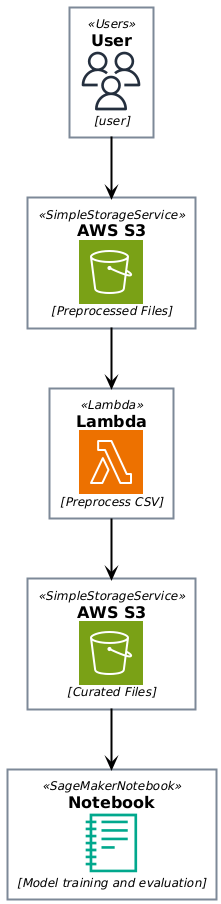

# AWS Event-Driven Project

This project implements an event-driven architecture for preprocessing CSV files uploaded to an S3 bucket using AWS Lambda. The architecture includes S3 buckets for data storage, a Lambda function for data processing, and a Jupyter notebook for model training and evaluation.

## Architecture Overview

- **S3 Buckets**:
  - **Landing Zone**: The initial bucket where CSV files are uploaded.
  - **Curated Zone**: The bucket where cleaned and preprocessed data is stored.

- **AWS Lambda Function**:
  - Triggered by events in the landing zone S3 bucket.
  - Reads CSV files, preprocesses the data by removing unnecessary attributes and rows with missing significant attributes, and saves the cleaned data to the curated zone.

- **Jupyter Notebook**:
  - Loads preprocessed data from the curated S3 bucket.
  - Trains a machine learning model using the scikit-learn library and evaluates its performance.

## Prerequisites

- AWS Account
- Terraform installed
- Python 3.12 installed
- Jupyter Notebook installed
- AWS CLI configured with appropriate permissions

## Deployment Instructions

1. **Install Dependencies**:

   ```
   Per notebook in notebooks folder
   pip install -r requirements.txt
   ```

3. **Deploy Infrastructure**:
   Navigate to the `terraform` directory and run the following commands:

   ```
   terraform init
   terraform apply
   ```

   Review the changes and confirm the deployment.

4. **Upload CSV Files**:
   Upload your CSV files to the landing zone S3 bucket created during the Terraform deployment.

5. **Run the Jupyter Notebook**:
   Open the Jupyter notebook located in `src/notebooks/price_prediction/price-prediction.ipynb` to train and evaluate your machine learning model using the preprocessed data.

## Cleanup

To remove the deployed infrastructure, run the following command in the `terraform` directory:

```
terraform destroy
```

## Architecture



## Possible New Capabilities

- [Integration of Lambda Layers](https://docs.aws.amazon.com/lambda/latest/dg/chapter-layers.html) for reusable code across multiple functions
- Modularize terraform resources for reusability
- Establishment of CI/CD pipelines for automated testing and deployment
- Notebook LifeCycle Implementation for continous model training when new dataset arrives
